<h1>Sean Halford - T1A2</h1>
<h2> Portfolio designed and developed by Sean Halford </h2>
 
<h3>Links:</h3>
<ul>
<li><a href="https://seanhalfordt1a2.netlify.app">Website</a> deployed by Netlify </li>
<li><a href="https://github.com/shalforb/-SeanHalford-_T1A2">Github</a> Repository</li>
<li><a href="https://youtu.be/W1tHvDFg19A">Slidedeck </a> Presentation</li>
</ul>

This portfolio website was designed with the intention to showcase my skills and experience as a web developer whilst simultaneously blend my dexterity as a visual designer. It was important to marry my own personal distinct visual flair within a very simple, functional website frame. The website was created from the perspective of simplicity; the visuals using nothing but striking gradients, shapes and textures while the website itself implementing minimal yet functional features. 

The homepage is a perfect example of this - using a very simplistic illustration as the page's background with 2 simple headers taking up the majority of the page. Although only three components are used, it effectively translates how I as a web dev prioritise my work. This continues on through to the other pages, which can be explored using a very basic yet clean nav bar at the top of the page. Other pages include 
<ul> 
<li> A basic About Me section - which similarly disusses these concepts.</li>
<li>A projects page - where you can find some of my previous work in the industry as well as my resume
<li> A blog page - containing recent updates on my work as a developer and to showcase some of my professional knowledge
<li> A contact page, which contains a simple form for users to access me via e-mail.
</ul>
A consistent footer is used throughout the website that also give users access to my professional accounts (Github, LinkedIn and Instagram).
 
 
Targeted users of this website would be potential employers or professionals in the IT industry looking to engage in my work as well as clients looking to engage with me in a freelance environment.

 
<h1>Sitemap: </h2>
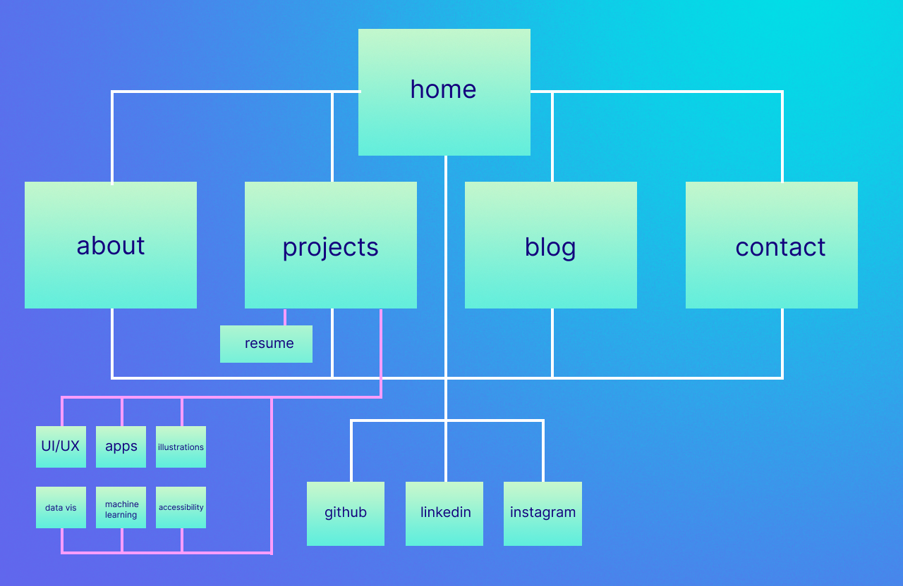
 
 
<h1>Wireframes:</h2>
 
<h2>Home:</h3>
 

 
 
<h2>About:</h3>
 

 
 
<h2>Projects:</h3>
 

 
 
<h2>Blog:</h3>
 

 
 
<h2>Contact:</h3>
 

 
<h1>Screenshots</h1>
 
<h2>Home page (Mobile):</h2>
 
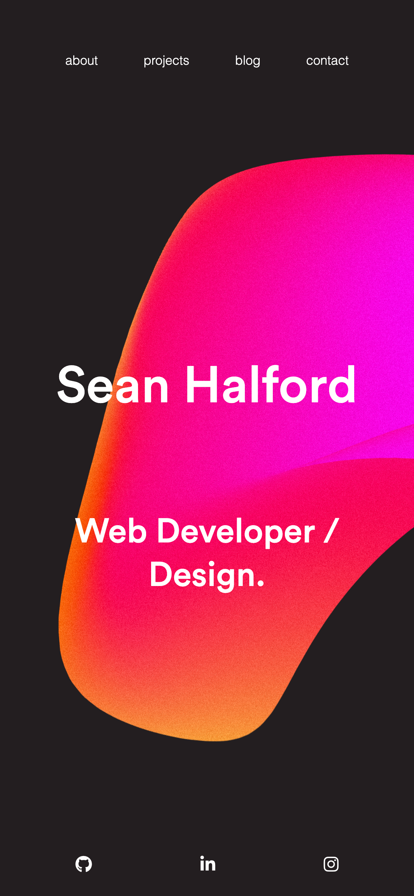
 
 
<h2>Home page (Tablet):</h2>
 
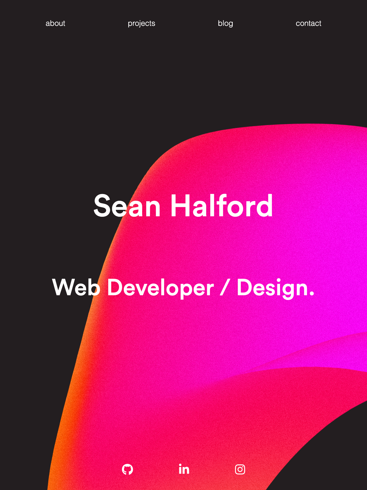
 
 
<h2>Home page (Desktop):</h2>
 
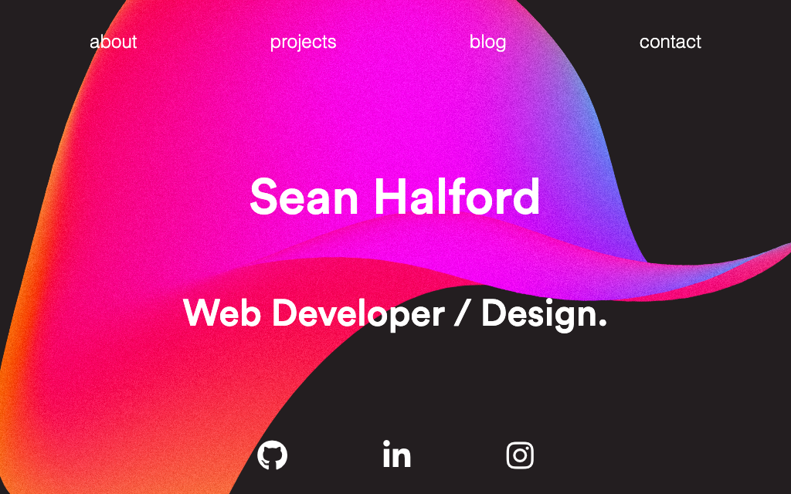
 
 
<h2>About (Mobile):</h2>
 
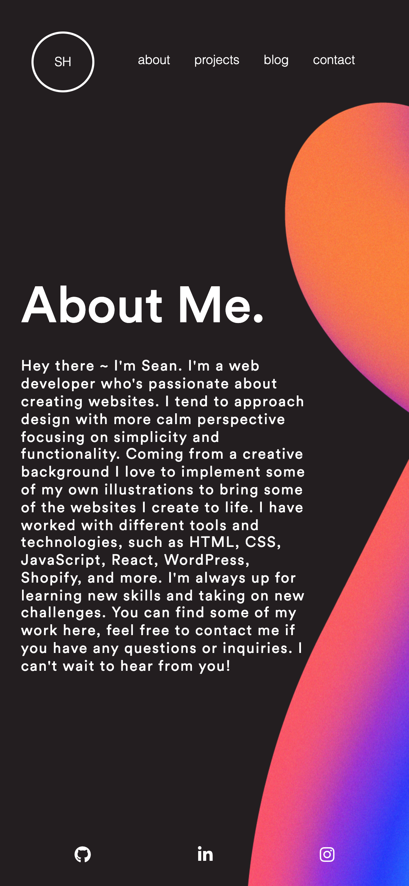
 
 
<h2>About (Tablet):</h2>
 
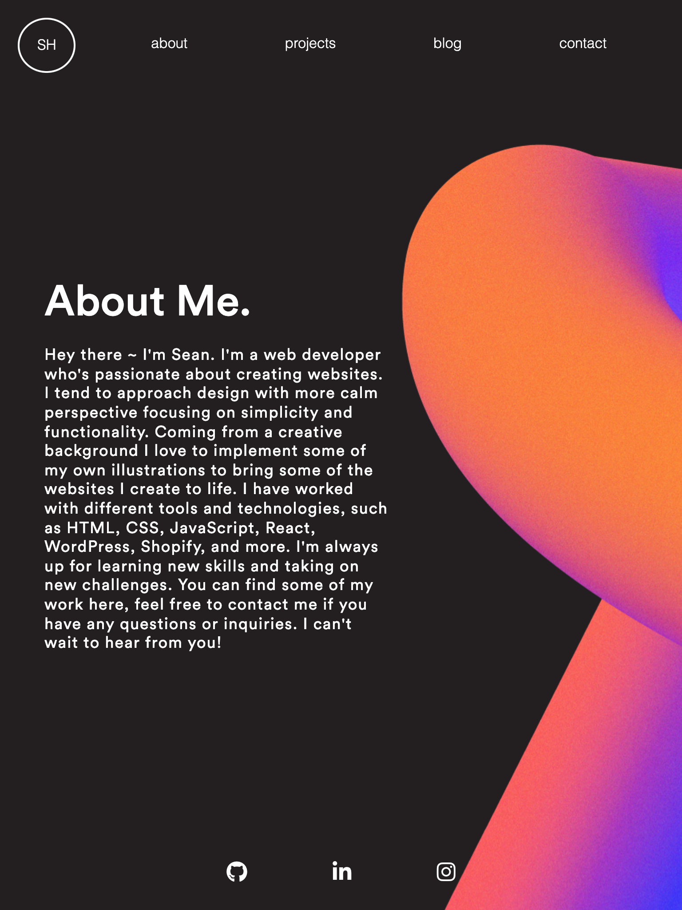
 
 
<h2>About (Desktop):</h2>
 
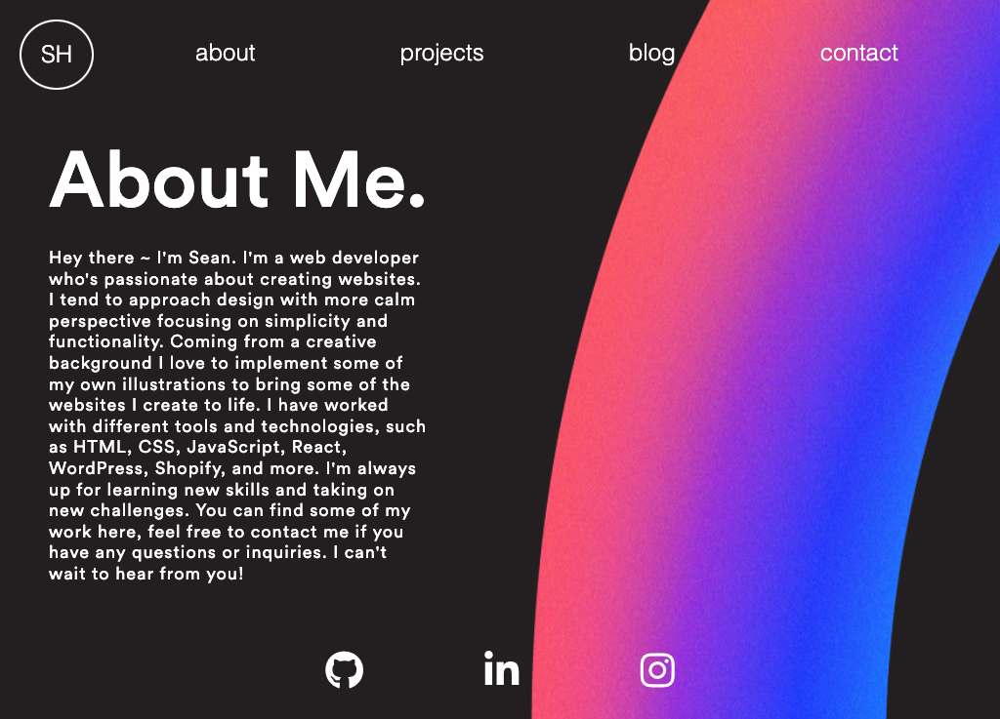
 
 
 
<h2>Projects (Mobile):</h2>
 
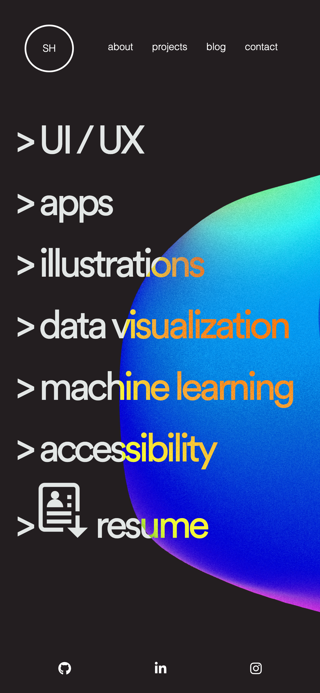
 
 
<h2>Projects (Tablet):</h2>
 
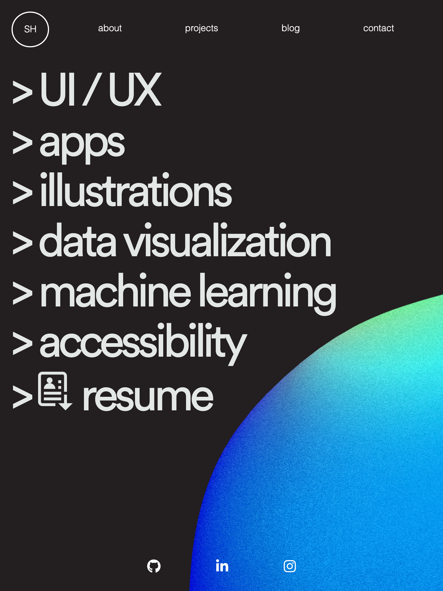
 
 
<h2>Projects (Desktop):</h2>
 
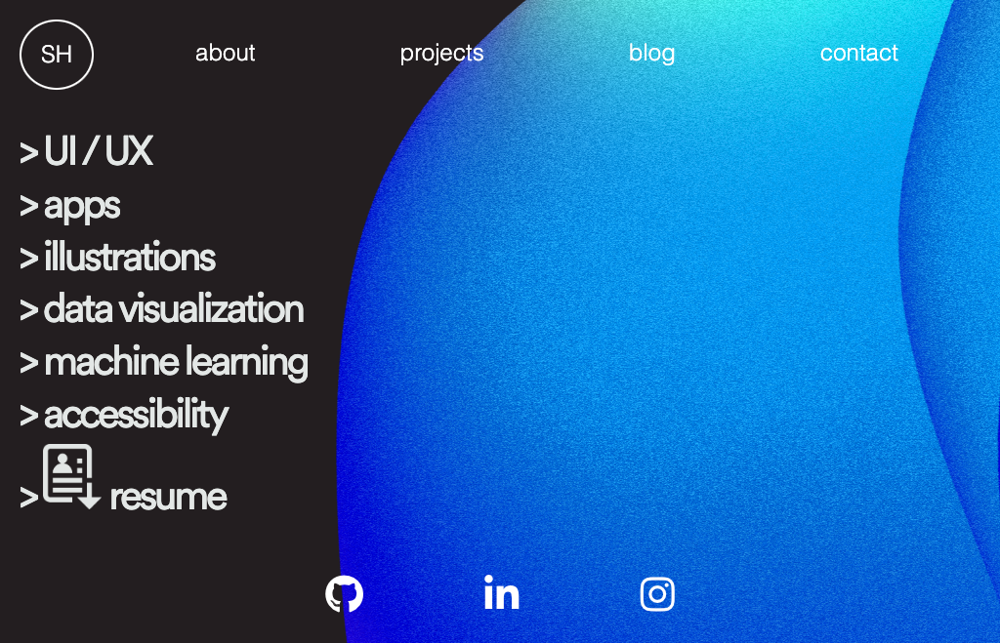
 
 
<h2>Blog (Mobile):</h2>
 

 
 
<h2>Blog (Tablet):</h2>
 

 
 
<h2>Blog (Desktop):</h2>
 

 
 
<h2>Contact (Mobile):</h2>
 
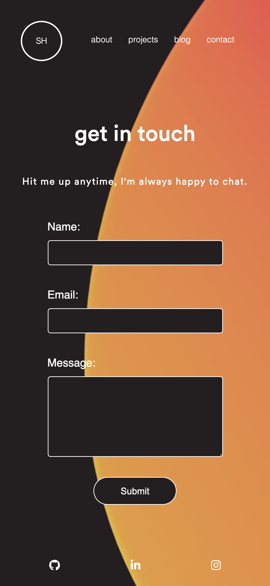
 
 
<h2>Contact (Tablet):</h2>
 
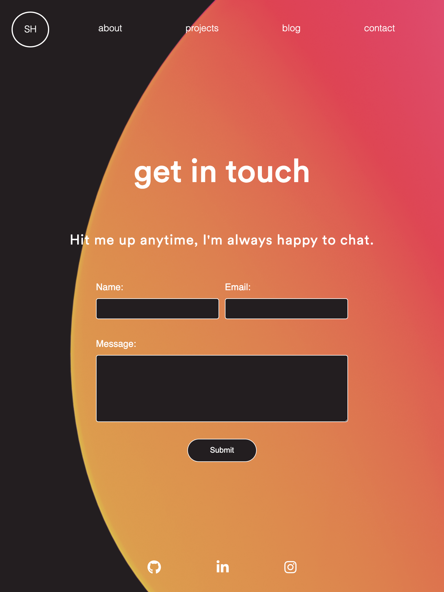
 
 
<h2>Contact (Desktop):</h2>
 
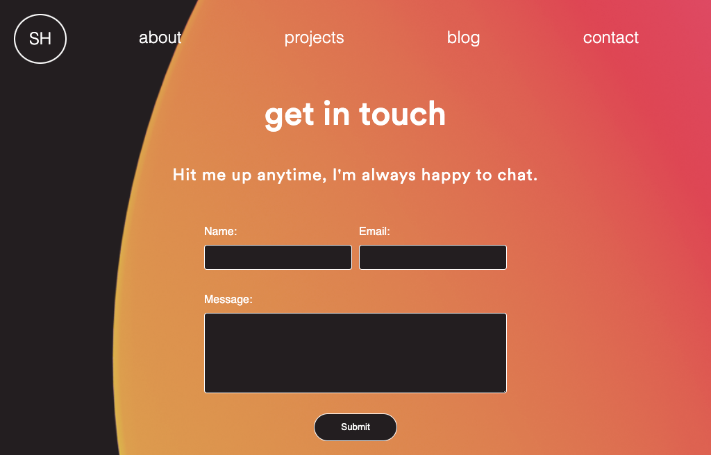
 
 
<h1>Tech Stack</h1>
This website was created with HTML, CSS and Sass.
Deployed with Netlify.